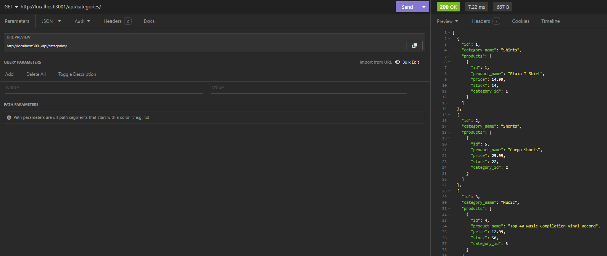

# e-commerce-back-end-platform-solutions

## Motivation
- In the competitive realm of e-commerce, embracing the latest technologies is essential for staying ahead. Our project aims to provide managers at internet retail companies with a cutting-edge backend solution, enabling them to compete effectively.

## Purpose
- We offer an Express.js API backend tailored for e-commerce websites, leveraging the latest technologies and best practices. This solution facilitates seamless data management, scalability, and reliability, empowering companies to thrive in the competitive e-commerce landscape.

## Problems
- This API backend addresses many issues such as the following: e-commerce websites that rely on outdated backend systems that hinder performance and scalability, companies who struggle to compete with other e-commerce giants without utilitzing the latest technologies, and setting up and managing databases for e-commerce applications can be both challenging and time-consuming.

## Learnings
- Throughout development, I was able to learn and grow in key areas such as Express.js and Sequelize integration, database optimization, API development and testing, environment variable management, and error handling. These learnings will enable me to deliver top-notch solutions that meet the evolving needs of the e-commerce industry.

## Screenshot

## Links
[Demo Video 1 URL](https://drive.google.com/file/d/1wMnGaZoT3kS3N1iGytostPd6dobORpjE/view?usp=sharing)

[Demo Video 2 (Insomnia) URL](https://drive.google.com/file/d/1mSo1S-Z_ipRCMi51OatmH6YJ5b9-NjI_/view?usp=drive_link)

[Repo URL](https://github.com/XtianHope/e-commerce-back-end-platform-solutions.git)

